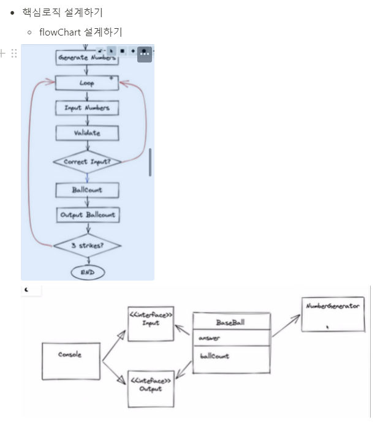

## 🥎🥎 BaseBall 게임을 설계해보자. 

- 요구사항 파악하기
    - 게임의 룰을 이해
    - 동작환경, 데이터의 범위
        - 3자리 숫자 사용.
        - 중복된 숫자를 사용하지 않는다.
        - 1~9를 사용한다. (0을 사용하지 않음)
        - Console 상에서 동작하는 프로그램을 제작.
- 일을 객체로 나누기/ 객체를 연관짓기
- - 핵심로직 설계하기
    - flowChart 설계하기

    