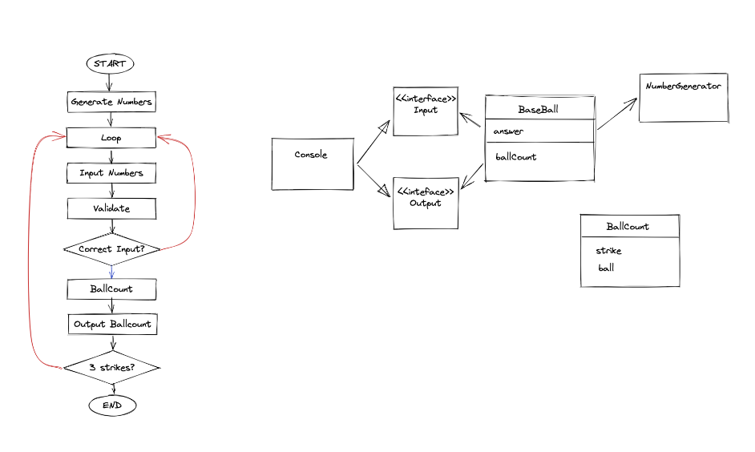

## 🥎🥎 BaseBall 게임을 설계해보자. 

- 요구사항 파악하기
    - 게임의 룰을 이해
    - 동작환경, 데이터의 범위
        - 3자리 숫자 사용.( 변경 가능하다 final 상수 변경시 가능 상수로 지정해놓는 이유)
        - 중복된 숫자를 사용하지 않는다.
        - 1~9를 사용한다. (0을 사용하지 않음)
        - Console 상에서 동작하는 프로그램을 제작.
- 일을 객체로 나누기/ 객체를 연관짓기
- Engine
  - Baseball
  - NumberGenerator
  - Input
  - Output
- Application
    - App
    - Console
    - FakerNumberGenerator
- 핵심로직 설계하기
    - flowChart 설계하기

## 이 프로젝트에서 가장 중요한 부분
- Solid 
- OOP
- Design Pattern 

비즈니스 로직이 구현된 Baseball에서는 추상체로부터만 의존하고 있다.

생성자 주입을 통해 의존성을 주입, 결합도를 줄인다.  우리가 사용하는 메인 로직은 어떠한 이유에서도 외부에서 의존하면 안된다. !!! 그래서 Generator을 분리한 이유이다.! 외부 라이브러리에 얽히면 안된다. 이러면 외부에 의해서 Handling될 수 있다.
